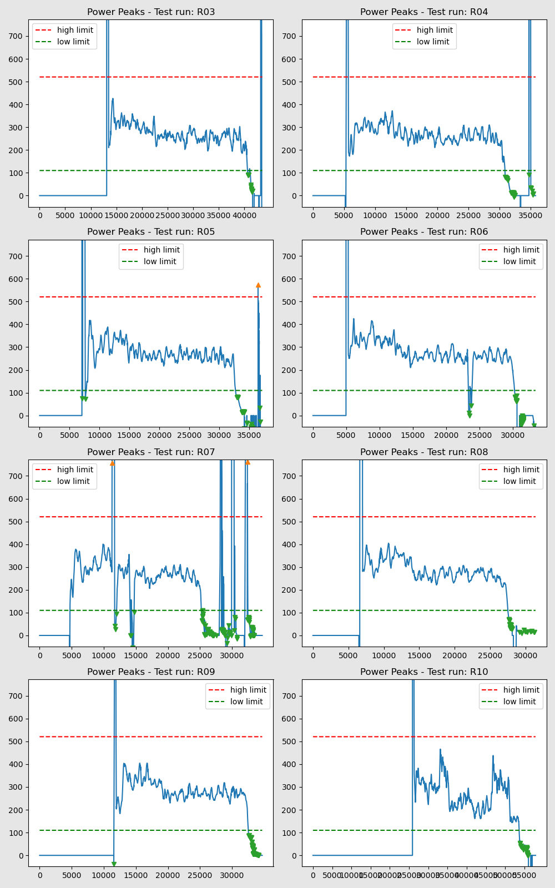
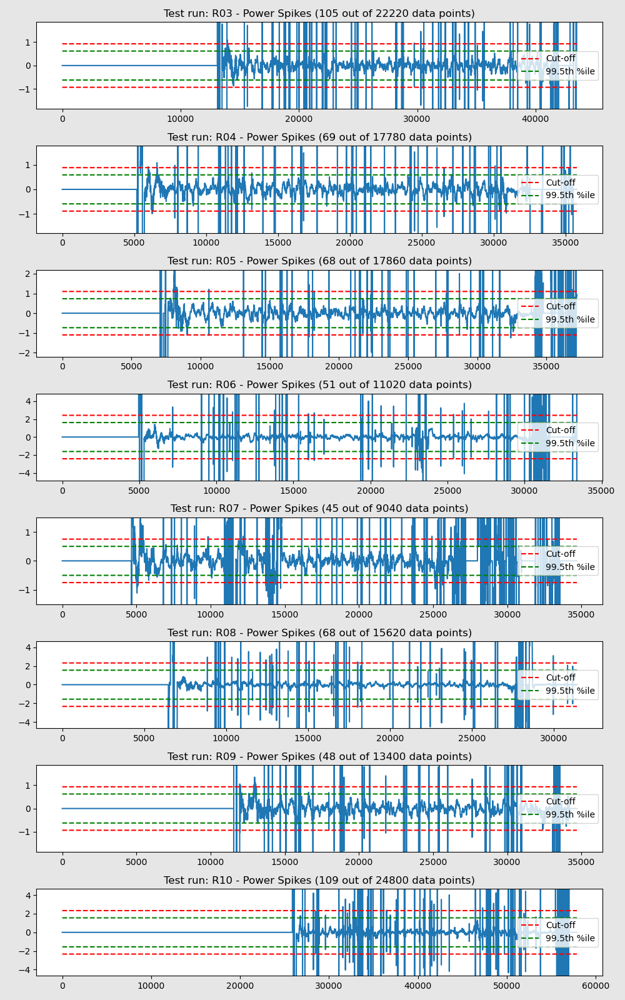
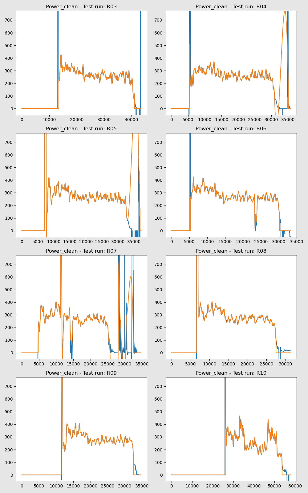

Various plots and data tables to help Validate data for all Test Runs  
### Data Issues  
- [Missing Data Records](MissingDataRecs.html)  
- [Speed Quantisation](SpeedFromDistance.html)  
- [Speed from Crank Angle](SpeedFromCrankAngle.html)  

#### Data Outliers  
- [AirSpeed-Peaks](AirSpeed-Peaks.html)
- [Cadence-Peaks](Cadence-Peaks.html)
- [CdA-Peaks](CdA-Peaks.html)
- [CrankAngularVelocity-Peaks](CrankAngularVelocity-Peaks.html)
- [Drag-Peaks](Drag-Peaks.html)
- [GroundSpeed-Peaks](GroundSpeed-Peaks.html)
- [Power-Peaks](Power-Peaks.html)
- [TotalWeight-Peaks](TotalWeight-Peaks.html)

#### Data Spikes  
- [AirSpeed-Spikes](AirSpeed-Spikes.html)
- [Cadence-Spikes](Cadence-Spikes.html)
- [CdA-Spikes](CdA-Spikes.html)
- [CrankAngleDelta-Spikes](CrankAngleDelta-Spikes.html)
- [Drag-Spikes](Drag-Spikes.html)
- [GroundSpeed-Spikes](GroundSpeed-Spikes.html)
- [Power-Spikes](Power-Spikes.html)
- [TotalWeight-Spikes](TotalWeight-Spikes.html)
- [Summary of Data Spikes](DataSpikes.html) 

#### Data Cleaned  
- [AirSpeed-Cleaned](AirSpeed-Cleaned.html)
- [Cadence-Cleaned](Cadence-Cleaned.html)
- [CdA-Cleaned](CdA-Cleaned.html)
- [CrankAngleDelta-Cleaned](CrankAngleDelta-Cleaned.html)
- [Drag-Cleaned](Drag-Cleaned.html)
- [GroundSpeed-Cleaned](GroundSpeed-Cleaned.html)
- [Power-Cleaned](Power-Cleaned.html)
- [TotalWeight-Cleaned](TotalWeight-Cleaned.html)

